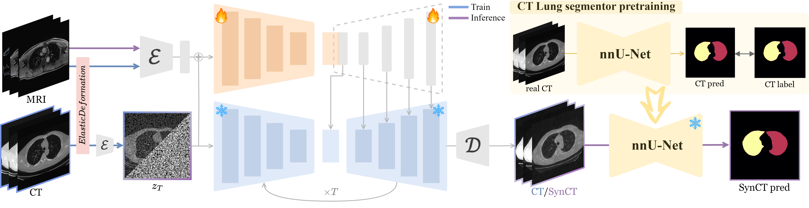
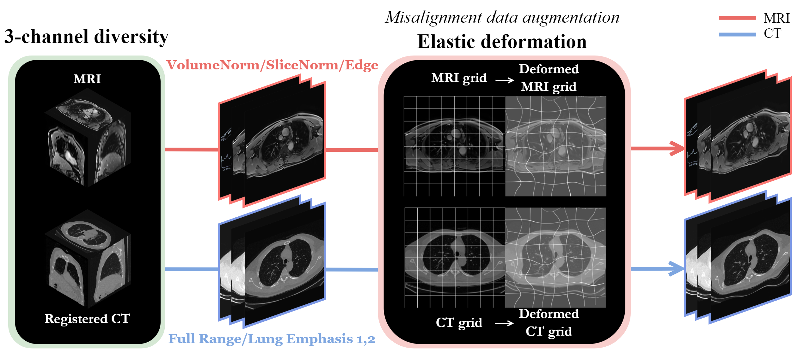
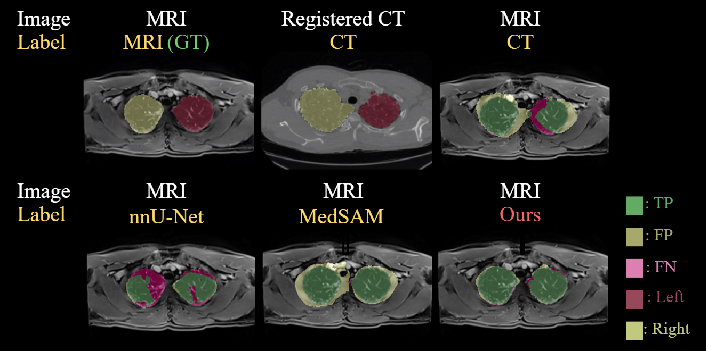
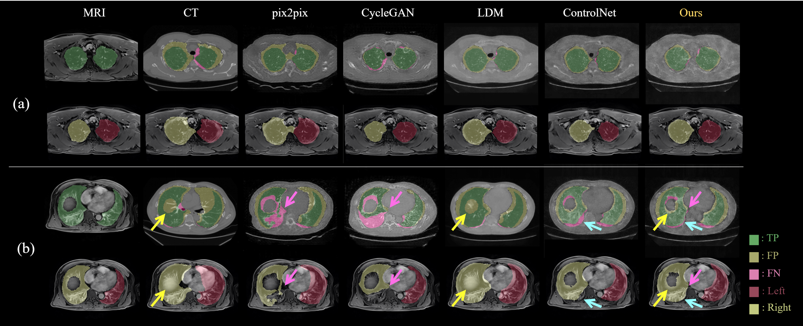
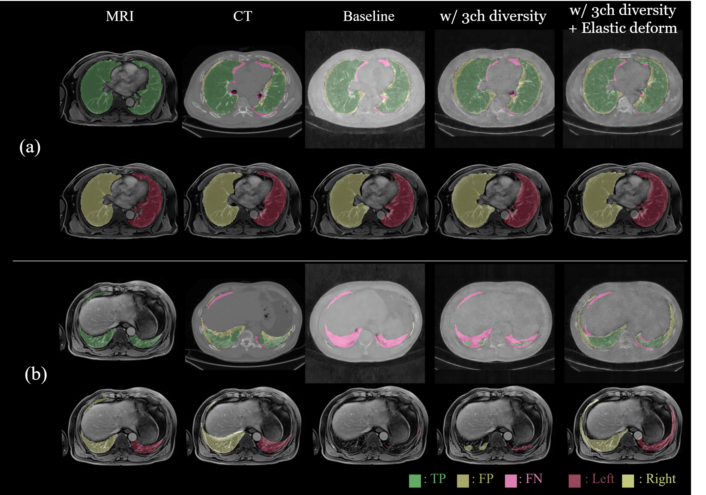

# Misalignment-aware MRI-to-CT synthesis for Lung segmentation on MRI

<!-- ---------------------------------------------------- -->

## Overview
This repository contains the code for "Misalignment-aware MRI-to-CT synthesis for Lung segmentation on MRI." This study addresses the challenges of lung segmentation on MRI images by synthesizing CT images that are aware of misalignment issues commonly encountered between MRI and CT modalities.
<br>


<!--  -->
<p align="center">
  
</p>

## Dataset
This project utilizes the in-house MR-CT paired datasets.

## Usage

### Installation

To set up your development environment, follow the steps below:

1. Create a new conda environment
    ```
    conda env create -f environment.yaml
    conda activate MR2CT4LungSeg
    ```

2. Download pretrained model(control_sd15_ini.ckpt).
    - Can be downloaded from [ControlNet](https://github.com/lllyasviel/ControlNet)'s [Hugging Face page](https://huggingface.co/lllyasviel/ControlNet). 
    - They should be stored in the "models" folder.
    
### Training
1. Set up your dataset according to the structure below. <br>
    ```
    Dataset/
    ├── Subject_01/
    │ ├── bl_img_CT_registered.nii.gz
    │ ├── bl_img_MRI.nii.gz
    │ ├── bl_label_CT_registered.nii.gz
    │ ├── bl_label_MRI.nii.gz # Only if MRI has a label
    │ ├── fu_img_CT_registered.nii.gz
    │ ├── fu_img_MRI.nii.gz
    │ ├── fu_label_CT_registered.nii.gz
    │ └── fu_label_MRI.nii.gz # Only if MRI has a label
    ├── Subject_02/
    │ ├── bl_img_CT_registered.nii.gz
    │ ├── bl_img_MRI.nii.gz
    │ ├── bl_label_CT_registered.nii.gz
    │ ├── bl_label_MRI.nii.gz # Only if MRI has a label
    │ ├── fu_img_CT_registered.nii.gz
    │ ├── fu_img_MRI.nii.gz
    │ ├── fu_label_CT_registered.nii.gz
    │ └── fu_label_MRI.nii.gz # Only if MRI has a label<br>
    └── ...
    ```

2. Apply 3-channel diversity and create the JSON files for the dataset.
    ```
    python 3ch_diversity.py --root_path /your/original_data/path/ --data_path /your/data/path/
    python mk_data_json.py --data_path /your/data/path/ --file_name your_filename.json --val_list Subject_05,Subject_07 --test_list Subject_04,Subject_06
    ```

3. Configure your training settings.

    - Edit the [config.yaml](https://github.com/Nejung-Rue/MR2CTforLungSeg/blob/main/config.yaml) file to adjust any training parameters, such as model paths, learning rate, dataset paths, etc.

4. MRI-to-CT translation model training.
    ```
    python MR2CT_train.py
    ```

    Our setting:
    - We fixed the prompt to "Professional high-quality translation from lung MRI-to-CT. Magnetic Resonance Imaging to Computated Tomography, Medical Imaging, extremely high detail, clean Background."
    - The batch size set to 4.
    - All diffusion models were trained with 1000 diffusion steps.

<!-- 4. Apply a pre-trained nnU-Net or similar segmentation model, initially trained on CT-CT label pairs, to the synthesized CT (SynCT) generated from MR2CT.
    - **Note:** The process of applying a pre-trained nnU-Net or similar segmentation model to the synthesized CT (SynCT) is not included in this repository. This step assumes you have a pre-trained model and will need to apply it separately using your own resources. -->


## Results
<p align="center">
  
  
  
</p>

<!-- 

<p align="center">
  
</p> -->
*The MRI-to-CT translation and segmentation results of different models. (a) and (b) show results for different subjects*

## Acknowledgments

This project references the following work:
- [ControlNet](https://github.com/lllyasviel/ControlNet) (License: Apache-2.0 license)

We have integrated insights and methodologies from ControlNet in our approach to translation tasks.